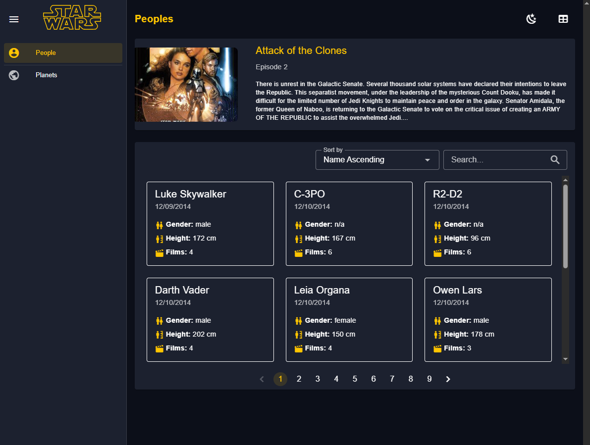

<!-- Improved compatibility of back to top link: See: https://github.com/othneildrew/Best-README-Template/pull/73 -->
<a id="readme-top"></a>


<!-- PROJECT LOGO -->
<br />
<div align="center">
  <a href="https://github.com/jacobogonzalez/star-wars-app">
    
  </a>

<h3 align="center">Star Wars Explorer</h3>

  <p align="center">
    This project is a single-page application (SPA) built to explore data from the Star Wars API (SWAPI) focusing on "People" and "Planets" domains. It features browsing, searching, sorting, and pagination capabilities with a responsive and accessible user interface, leveraging Vuetify for consistent design.
    <br />
    <a href="https://github.com/jacobogonzalez/star-wars-app"><strong>Explore the docs »</strong></a>
    <br />
    <br />
    <a href="https://github.com/jacobogonzalez/star-wars-app/issues/new?labels=bug&template=bug-report---.md">Report Bug</a>
    &middot;
    <a href="https://github.com/jacobogonzalez/star-wars-app/issues/new?labels=enhancement&template=feature-request---.md">Request Feature</a>
  </p>
</div>


<!-- TABLE OF CONTENTS -->
<details>
  <summary>Table of Contents</summary>
  <ol>
    <li>
      <a href="#about-the-project">About The Project</a>
      <ul>
        <li><a href="#built-with">Built With</a></li>
        <li><a href="#architectural-decisions">Architectural Decisions</a></li>
      </ul>
    </li>
    <li>
      <a href="#getting-started">Getting Started</a>
      <ul>
        <li><a href="#prerequisites">Prerequisites</a></li>
        <li><a href="#installation">Installation</a></li>
      </ul>
    </li>
    <li><a href="#usage">Usage</a></li>
    <li><a href="#roadmap">Roadmap</a></li>
    <li><a href="#contributing">Contributing</a></li>
    <li><a href="#contact">Contact</a></li>
  </ol>
</details>


<!-- ABOUT THE PROJECT -->
## About The Project
<div align="center">
 <a href="https://github.com/jacobogonzalez/star-wars-app">
    
  </a>
</div>
"Star Wars Explorer" is a Single-Page Application (SPA) designed to immerse Star Wars fans in the vast universe of the franchise. Utilizing the public Star Wars API (SWAPI), the application allows users to intuitively and responsively explore two key domains: "People" and "Planets."

With a clear and accessible user interface, the application offers browsing, searching (case-insensitive and partial by name), sorting (by name and creation date, ascending or descending), and pagination functionalities (10 items per page). Consistent design is ensured through the use of Vuetify, adapting to different screen sizes with tables on desktop and cards on mobile devices.

The primary goal is to provide an efficient and enjoyable tool for quickly discovering interesting facts about the galaxy, ensuring a smooth user experience with clear loading, error, and empty states, as well as basic accessibility support.

<p align="right">(<a href="#readme-top">back to top</a>)</p>


### Built With


- [Vue](https://vuejs.org/) — Frontend framework
- [Pinia](https://pinia.vuejs.org/) — State management for Vue
- [Vue Router](https://router.vuejs.org/) — Routing system
- [Vuetify](https://vuetifyjs.com/) — Material Design component framework
- [Vite](https://vitejs.dev/) — Lightning-fast build tool and dev server
- [TypeScript](https://www.typescriptlang.org/) — Static typing for JavaScript
- [Vitest](https://vitest.dev/) — Unit testing framework
- [Playwright](https://playwright.dev/) — End-to-end testing framework
- [Testing Library](https://testing-library.com/docs/vue-testing-library/intro/) — For testing Vue components
- [Sass Embedded](https://sass-lang.com/dart-sass) — Used with Vuetify styles
- [JS DOM](https://github.com/jsdom/jsdom) — JavaScript implementation of the DOM for testing
- [@mdi/font](https://pictogrammers.com/library/mdi/) — Material Design Icons


<p align="right">(<a href="#readme-top">back to top</a>)</p>


### Architectural Decisions

This section outlines the key architectural decisions made during the development of "Star Wars Explorer," focusing on **state management**, **styling**, and **API abstraction**.

* **State Management:** For managing the application's state, **Pinia**  was chosen. This provides a centralized store for all components, making state predictable and debuggable. It helps in handling complex data flows across various parts of the application, especially for shared data like fetched characters and planets, search queries, and pagination states.

* **Styling and UI Framework:** **Vuetify** was selected as the primary UI framework. Its comprehensive set of pre-built, Material Design-compliant components accelerates development and ensures a consistent and responsive user interface across different devices. This decision also simplifies accessibility considerations, as Vuetify components are designed with accessibility in mind.

* **API Abstraction:** To interact with the Star Wars API (SWAPI), a dedicated **API service layer** was implemented. This abstraction separates the data fetching logic from the UI components, making the codebase cleaner, more maintainable, and easier to test. 

* **Routing:** **Vue Router** is used for handling client-side routing, enabling the single-page application experience. It allows for defining routes, managing navigation, and handling dynamic route parameters, ensuring a smooth transition between different views within the application without full page reloads.

<p align="right">(<a href="#readme-top">back to top</a>)</p>

<!-- GETTING STARTED -->
## Getting Started

This is an example of how you may give instructions on setting up your project locally.
To get a local copy up and running follow these simple example steps.

### Prerequisites

This is an example of how to list things you need to use the software and how to install them.
* npm
  ```sh
  npm install npm@latest -g
  ```

### Installation

1. Clone the repo
   ```sh
   git clone https://github.com/jacobogonzalez/star-wars-app.git
   ```
2. Install NPM packages
   ```sh
   npm install
   ```

3. Run the development server
   ```sh
   npm run dev
   ```
<p align="right">(<a href="#readme-top">back to top</a>)</p>


<!-- USAGE EXAMPLES -->
## Usage

npm run devs will start the application in development mode, typically accessible at http://localhost:5173 (or another port if 5173 is in use).


The application should now be accessible in your web browser.

### How to Execute Tests and CI

This project includes unit tests for core components and an end-to-end (E2E) smoke test to validate the main user flow.

Unit Tests

Unit tests are written using Vitest. They cover critical modules to ensure individual components function as expected

To run unit tests:

 ```sh
   npm run test
   ```

End-to-End (E2E) Smoke Test

An end-to-end smoke test is implemented using Playwright. This test covers the primary user journey: loading the page, searching, sorting, and then paginating.

To run the Playwright tests:
Headless mode (runs tests in the background, ideal for Continuous Integration):

```sh
   npm run test:e2e
   ```
UI mode (opens a browser window, useful for debugging and visualizing test execution):

   ```sh
   npm run test:e2e:ui
   ```

<p align="right">(<a href="#readme-top">back to top</a>)</p>


<!-- ROADMAP -->
## Roadmap

- [ ] Continue expanding unit test coverage to include additional critical modules.

See the [open issues](https://github.com/jacobogonzalez/star-wars-app/issues) for a full list of proposed features (and known issues).

<p align="right">(<a href="#readme-top">back to top</a>)</p>


<!-- CONTRIBUTING -->
## Contributing

Contributions are what make the open source community such an amazing place to learn, inspire, and create. Any contributions you make are **greatly appreciated**.

If you have a suggestion that would make this better, please fork the repo and create a pull request. You can also simply open an issue with the tag "enhancement".
Don't forget to give the project a star! Thanks again!

1. Fork the Project
2. Create your Feature Branch (`git checkout -b feature/AmazingFeature`)
3. Commit your Changes (`git commit -m 'Add some AmazingFeature'`)
4. Push to the Branch (`git push origin feature/AmazingFeature`)
5. Open a Pull Request


<p align="right">(<a href="#readme-top">back to top</a>)</p>


<!-- CONTACT -->
## Contact

Jacobo Gonzalez

Project Link: [https://github.com/jacobogonzalez/star-wars-app](https://github.com/jacobogonzalez/star-wars-app)

<p align="right">(<a href="#readme-top">back to top</a>)</p>

